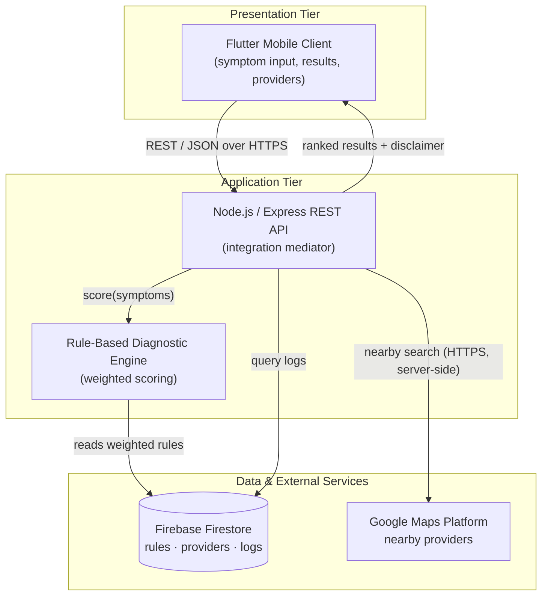
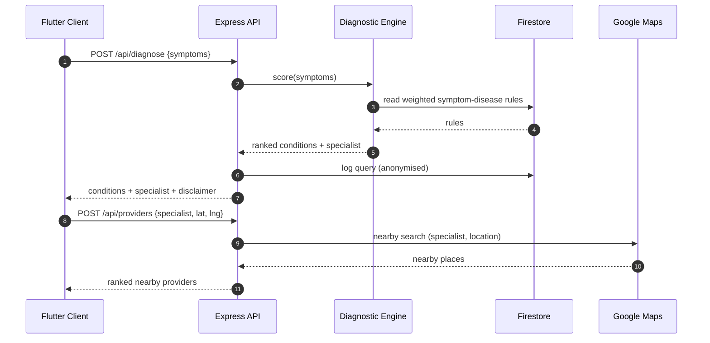
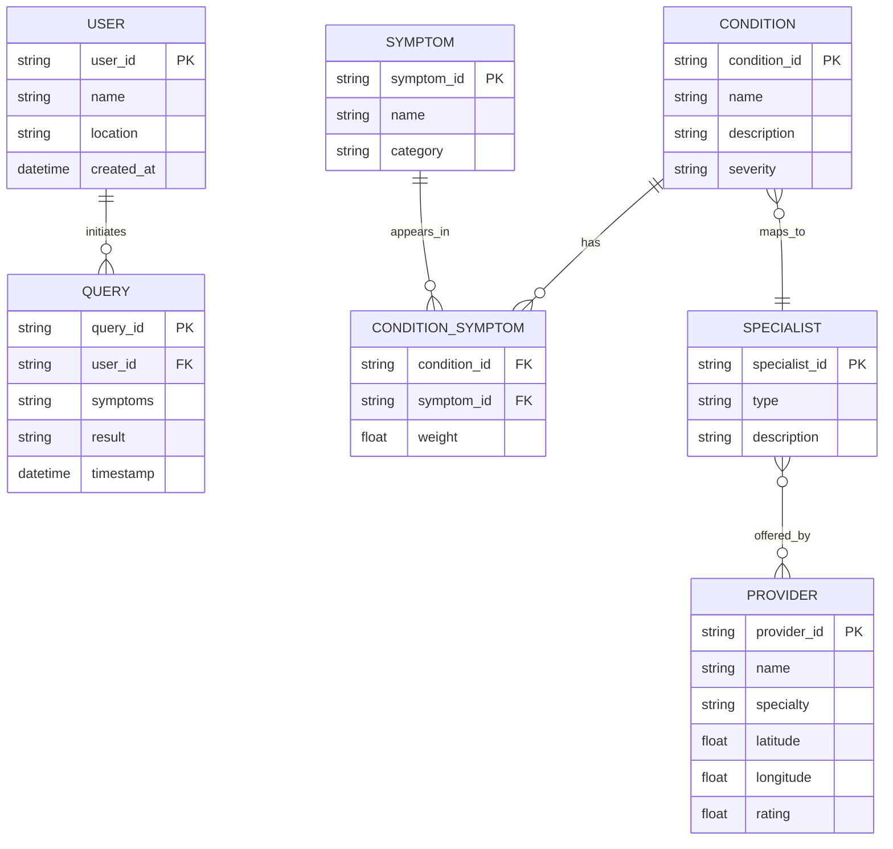

# System Integration Report — Figures

Editable mermaid sources for the three figures embedded in
*Amy Njau SWE3090XA System Integration Report.docx*. Paste any block into a
mermaid renderer (e.g. https://mermaid.live) to tweak and re-export.

The PNGs in this folder were rendered from these sources (navy/blue theme to
match the app and prior reports).

## Figure 3.1 — Integration architecture

## Figure 3.2 — End-to-end data flow (sequence)

## Figure A.1 — Entity Relationship Diagram

