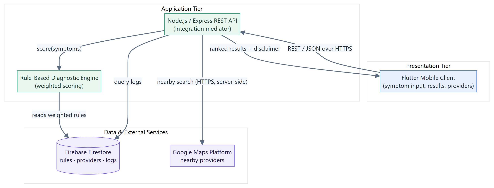
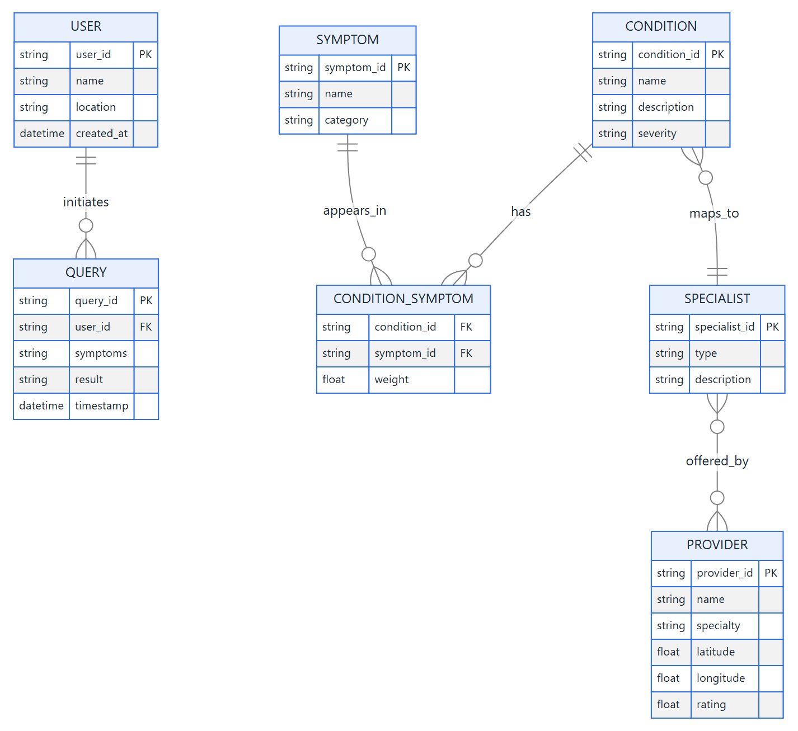
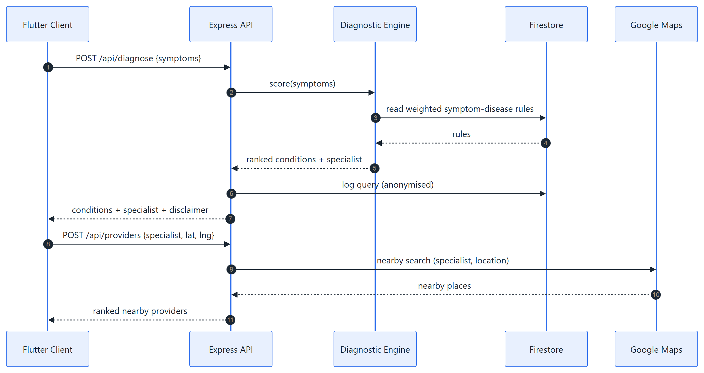
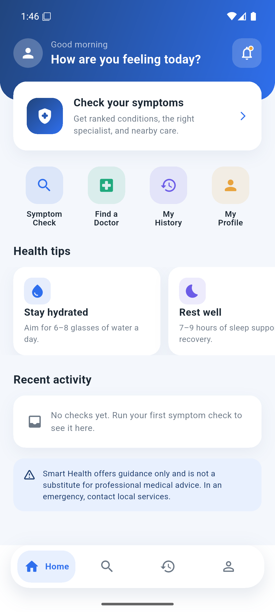
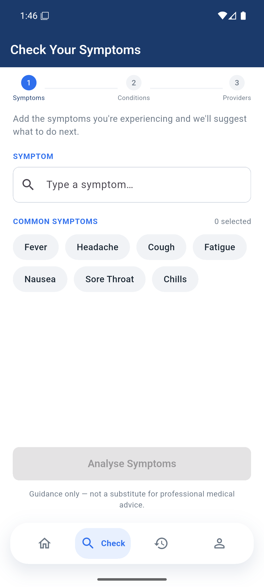
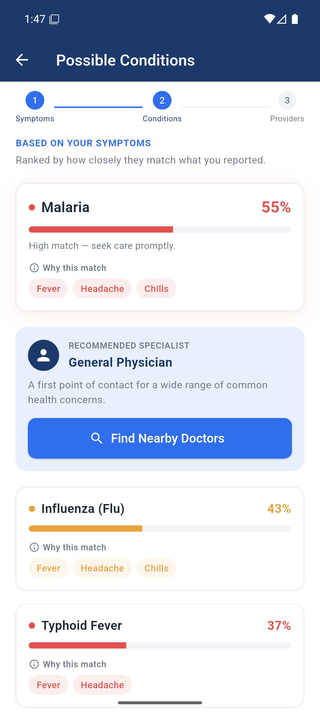
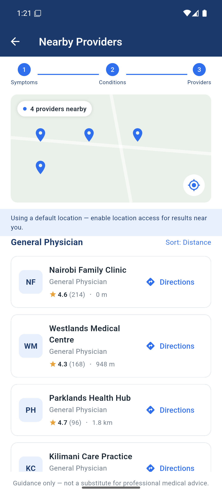
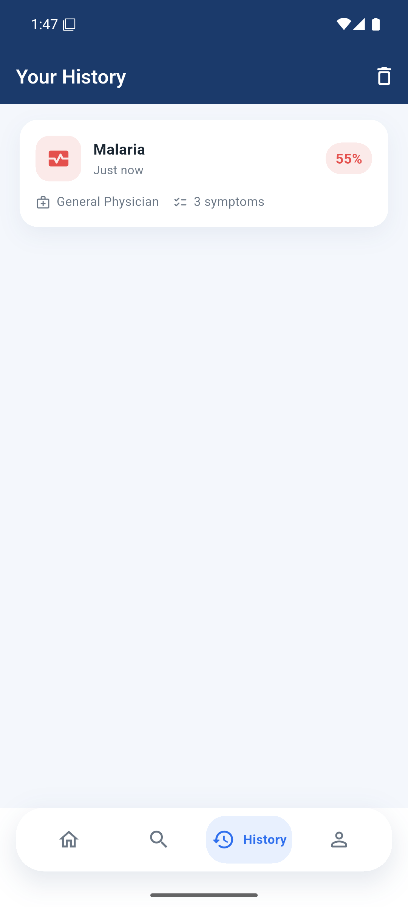

# Abstract

Access to timely medical guidance remains constrained in many developing
regions, where low doctor-to-patient ratios, travel distance, and consultation
cost combine to delay care. This project delivers the Smart Health Symptom
Checker and Doctor Recommendation System: a cross-platform mobile application
that accepts user-reported symptoms, returns a ranked list of probable
conditions together with the reasoning behind each ranking, recommends the
appropriate medical specialist, and locates nearby qualified providers using the
user's real-time position.

The system is built on a three-tier architecture: a Flutter mobile client, a
Node.js and Express REST API hosting a rule-based diagnostic engine, and a
swappable data and location tier. The diagnostic engine scores each candidate
condition by summing the weights of the symptoms the user reported and dividing
by that condition's maximum possible weight, producing a normalised confidence
value. Every score therefore traces back to specific named symptoms, which the
interface surfaces to the user. This explainability is the project's central
design commitment and the principal reason a rule-based approach was chosen over
an opaque machine-learning model in a safety-sensitive domain.

The delivered system implements a knowledge base of 15 conditions, 35 symptoms,
and 9 specialist types, exposes five REST endpoints, and is verified by an
automated suite of 15 tests, all of which pass. Functional and non-functional
requirements defined at the midterm stage were met, including deterministic
results, graceful degradation when location permission is denied, and a guidance
disclaimer attached centrally to every diagnosis response so that it cannot be
omitted. The report documents the requirements, design, implementation, testing,
and results, and sets out the security hardening, clinical validation, and
persistence work required before any real-world deployment.

# Chapter One: Introduction

## 1.1 Background of the Study

Access to timely and accurate medical guidance remains a major challenge across
many parts of the world, and particularly in developing regions where the ratio
of doctors to patients is critically low. Large populations in low- and
middle-income countries continue to face shortages of healthcare workers, long
travel distances to facilities, and high out-of-pocket consultation costs. As a
result, many individuals delay seeking professional medical attention, not
because they are unwilling, but because they are uncertain about the severity of
their symptoms or do not know which type of practitioner to consult.

At the same time, mobile-phone penetration in these regions has grown rapidly,
placing internet-connected devices in the hands of populations that were
previously difficult to reach through conventional healthcare infrastructure.
This convergence creates a meaningful opportunity for mobile health solutions to
bridge part of the gap between symptom onset and appropriate care.

The Smart Health Symptom Checker and Doctor Recommendation System responds to
this opportunity by providing a digital-first tool that helps users make
informed health decisions. By entering their symptoms into a mobile application,
users receive condition suggestions generated through a transparent rule-based
analysis engine. The system then advises which type of medical specialist to
consult, and recommends nearby qualified providers based on the user's real-time
location. The application acts as an accessible first point of guidance: not a
replacement for professional care, but a bridge toward it.

## 1.2 Emerging Issues

Several emerging issues motivate and shape this project.

**Rising demand for self-directed care.** Patients increasingly turn to online
sources to interpret their symptoms before deciding whether and where to seek
help. Unstructured web searches, however, often produce alarming or
contradictory information.

**Proliferation of digital symptom checkers.** A growing number of commercial
symptom-checking applications exist, but many are designed for high-income
contexts, require constant connectivity, or do not connect the user to local,
reachable care.

**Localisation gap.** Few existing tools account for the realities of developing
regions: nearby facilities, locally available specialists, and low-bandwidth
conditions.

**Trust, safety, and explainability.** As automated health tools become more
common, there is increased scrutiny of how recommendations are generated.
Rule-based systems offer transparency that opaque models cannot easily match,
which is valuable in a sensitive domain such as health.

**Data privacy expectations.** Handling even limited health-related data raises
legitimate concerns around consent, storage, and confidentiality that any
responsible solution must address.

## 1.3 Problem Statement

Many individuals lack access to timely, affordable, and location-aware medical
guidance, leading to delayed diagnoses and preventable deterioration of their
health. Existing solutions are either too generic to be trustworthy, too
expensive for the average user, or not localised to the user's context, failing
to connect them to qualified care that is actually within reach.

There is therefore a need for an accessible mobile application that can
interpret a user's symptoms, suggest probable conditions in an explainable
manner, recommend the appropriate type of specialist, and direct the user to
nearby qualified healthcare providers, all through a simple interface usable by
people with varying levels of digital literacy.

## 1.4 Objectives

### 1.4.1 Main Objective

To design and develop a cross-platform mobile application that accepts
user-reported symptoms, returns a ranked list of probable medical conditions,
recommends an appropriate medical specialist, and identifies nearby qualified
healthcare providers based on the user's real-time location.

### 1.4.2 Specific Objectives

1. To design and develop a mobile application that accepts user-inputted
   symptoms and returns a ranked list of possible medical conditions.
2. To implement a rule-based diagnostic engine capable of mapping symptom
   combinations to probable diseases with reasonable accuracy.
3. To integrate a specialist recommendation module that suggests the appropriate
   type of doctor based on the predicted condition.
4. To incorporate location-based services that identify and recommend nearby
   qualified healthcare providers or medical facilities.
5. To provide a simple, intuitive user interface accessible to users with
   varying levels of digital literacy.

## 1.5 Justification and Significance

This project is justified by the persistent gap between the demand for
healthcare guidance and the supply of accessible professional care in developing
regions. By combining symptom analysis with localised, location-aware provider
recommendation, the system addresses a need that existing tools only partially
serve.

For users, it provides a free, easy-to-use first point of guidance that reduces
uncertainty, encourages earlier care-seeking, and helps users reach the right
kind of practitioner faster. For the healthcare system, guiding patients toward
the appropriate specialist and nearby facilities can reduce mis-directed visits
and ease pressure on overstretched general services. For underserved
communities, the emphasis on localisation and a lightweight, explainable
approach suits low-connectivity environments that commercial alternatives often
overlook. Academically, the project demonstrates the practical application of
software-engineering principles, including requirements engineering, system
design, rule-based inference, API integration, automated testing, and Agile
delivery, to a real-world problem of social value.

## 1.6 Scope and Limitations

The delivered system covers the full path from symptom entry to nearby-provider
recommendation on Android, with an architecture that permits an iOS build
without a rewrite. It does not extend to telemedicine consultation, appointment
booking, electronic health records, payments, or prescription handling.

Three limitations are stated plainly here and revisited in Section 7.3. First,
the knowledge base is an educational rule set curated for this project and has
not been clinically validated; the application is a guidance tool and not a
medical device. Second, the query log is held in memory and is therefore lost
when the server restarts. Third, the deployed prototype has no user
authentication, so history is device-local rather than per-account.

# Chapter Two: Literature Review

This chapter reviews existing symptom-checker and digital-health systems,
compares their capabilities against the goals of this project, identifies the
gaps they leave open, and states the unique contributions of the delivered
system.

## 2.1 Review of Existing Systems

### 2.1.1 WebMD Symptom Checker

WebMD provides a widely used web-based symptom checker that allows users to
select symptoms on a body map and returns a list of possible conditions with
accompanying articles. It is information-rich but primarily an educational
reference; it does not connect users to specific local practitioners and is
oriented toward a North American audience and healthcare context.

### 2.1.2 Ada Health

Ada is a mobile symptom-assessment application that conducts a structured,
conversational interview and returns possible causes together with guidance on
next steps. It is well designed and clinically informed, but it is built
primarily for connected, higher-income markets, does not focus on surfacing
nearby local providers, and its underlying assessment logic is largely opaque to
the end user.

### 2.1.3 Babylon Health

Babylon combined symptom checking with telemedicine consultations, allowing
users to speak with clinicians remotely. While powerful, it depends on reliable
connectivity, an available clinician network, and a subscription or payment
model, which limits its accessibility in low-resource settings.

### 2.1.4 Buoy Health and K Health

Buoy Health and K Health both use data-driven approaches to triage symptoms and
suggest next steps, with K Health additionally drawing on large clinical
datasets. These tools illustrate the value of structured triage but, like the
others, are tailored to specific national healthcare systems and do not provide
localised facility recommendation for developing-region users.

### 2.1.5 Academic Evaluations

Independent academic audits of symptom checkers, notably the BMJ audit study by
Semigran and colleagues (2015), found that the diagnostic and triage accuracy of
these tools varies considerably. That body of work underpins two design
principles adopted here: such tools should be positioned explicitly as guidance
rather than diagnosis, and an explainable, well-validated rule base is
preferable to an opaque one in a safety-sensitive domain.

## 2.2 Comparative Analysis

The table below compares representative existing systems against the core
capabilities targeted by this project.

| System | Symptom analysis | Specialist recommendation | Location-aware providers | Explainable logic | Suited to low connectivity |
|---|---|---|---|---|---|
| WebMD Symptom Checker | Yes | Partial | No | Partial | No |
| Ada Health | Yes | Partial | No | No | No |
| Babylon Health | Yes | Yes, via clinician | Partial | No | No |
| Buoy Health / K Health | Yes | Partial | No | No | No |
| **Smart Health (this project)** | **Yes** | **Yes** | **Yes** | **Yes** | **Yes** |

*Table 2.1: Comparative analysis of existing symptom-checker systems.*

## 2.3 Identified Gaps

The review reveals four consistent gaps. Most tools are designed for specific
high-income healthcare systems and do not surface nearby, reachable providers
relevant to a developing-region user. Few systems explicitly translate a
probable condition into a clear recommendation of which type of specialist to
consult. Many modern tools provide little visibility into how a recommendation
was produced, which undermines trust in a sensitive domain. Finally, solutions
depending on continuous connectivity, large models, or paid consultations are
poorly suited to low-resource environments.

## 2.4 Unique Contributions

The delivered system addresses those gaps through four contributions. It
provides integrated end-to-end guidance in a single workflow, moving the user
from symptom entry to probable condition, to the right specialist, to a nearby
provider. It uses real-time geolocation to recommend providers within reach of
the user. It applies explainable rule-based inference over a transparent
weighted symptom-condition matrix whose reasoning is surfaced in the interface
rather than hidden. And it is deliberately lightweight, targeting varying
digital-literacy levels and lower-connectivity conditions.

# Chapter Three: Methodology

## 3.1 Development Approach

The project followed an Agile software-development methodology implemented
through short, iterative sprints. Agile was selected over a strictly sequential
approach such as Waterfall because a health-guidance tool benefits from
continuous testing, frequent feedback, and incremental refinement, particularly
for the diagnostic rule base, which had to be validated and tuned progressively
rather than fixed up front.

Development was organised into four phases. The requirements and research phase
reviewed existing symptom-checker solutions, defined the symptom-condition rule
base, and settled the architecture. The design phase produced the data models,
the API contract, and the inference design. The development and integration
phase built the mobile application, implemented the diagnostic engine, added
geolocation, and connected the backend. The testing phase covered unit,
integration, and acceptance testing.

## 3.2 Project Timeline

The schedule spanned approximately ten weeks. All milestones are complete.

| Week | Activity | Deliverable | Status |
|---|---|---|---|
| 1-2 | Requirements gathering and literature review | Requirements document | Complete |
| 3-4 | System design, data models, API contract | Design models and wireframes | Complete |
| 5-6 | Database design, backend setup, rule-engine development | Working rule engine | Complete |
| 7-8 | Mobile UI development: symptom input and results | Alpha build | Complete |
| 9 | Geolocation integration and specialist recommendation | Beta build with location | Complete |
| 10 | End-to-end testing, fixes, documentation, submission | Tested application and report | Complete |

*Table 3.1: Project timeline and final status.*

## 3.3 Resources and Tools

Development used a personal computer, an Android device, and the Android
emulator for testing. The software stack is summarised below.

| Category | Technology | Purpose |
|---|---|---|
| Frontend | Flutter (Dart) | Cross-platform mobile interface, Android first, iOS-ready |
| Backend | Node.js with Express | REST API and integration mediator |
| Diagnostic logic | Rule-based inference engine | Weighted symptom-condition scoring |
| Data | JSON data store, Firebase Firestore ready | Knowledge base, specialists, providers, query log |
| Location | Google Maps Platform, device geolocation | Nearby provider discovery |
| Testing | Node.js built-in test runner | Automated unit and integration tests |
| Version control | Git and GitHub | Source-code management |
| Tooling | VS Code, Android Studio | Development, debugging, emulation |

*Table 3.2: Tools and technologies.*

## 3.4 Requirements

### 3.4.1 Functional Requirements

The system shall allow users to input symptoms through structured selection;
analyse them with the rule-based engine and return a ranked list of probable
conditions; recommend the appropriate specialist for the top-ranked condition;
detect the user's location with permission and recommend nearby providers;
display a clear disclaimer that the application provides guidance only; and
handle denial of location permission gracefully while still providing symptom
and specialist guidance.

### 3.4.2 Non-Functional Requirements

Usability requires an interface that is simple for users with varying digital
literacy. Performance requires symptom analysis to return within a few seconds
on a typical mobile connection. Reliability requires the engine to produce
consistent results for identical input and to degrade gracefully when services
are unavailable. Security and privacy require health and location data to be
handled with consent, minimisation, and confidentiality. Portability requires an
Android-first architecture that permits iOS extension without a rewrite.
Maintainability requires the rule base to accept new symptoms, conditions, and
specialists without changes to core logic.

# Chapter Four: System Design

## 4.1 Architecture

The system adopts a three-tier architecture. The presentation layer is the
Flutter mobile application, responsible for symptom input, displaying ranked
results and specialist advice, and listing nearby providers. The application
layer is the Node.js and Express backend, which exposes REST endpoints, hosts
the rule-based engine, performs specialist mapping, and orchestrates calls to
the location service. The data layer holds the knowledge base, specialist
mappings, provider records, and an anonymised query log, with the Google Maps
Platform supplying external place data.

A deliberate design decision is that the mobile client contains no diagnostic
logic whatsoever. It collects input, calls the API, and maps JSON responses into
typed models. All reasoning lives behind the API boundary, which keeps the
client thin, makes the engine independently testable, and allows the rule base
to be corrected without shipping a new app version.



*Figure 4.1: High-level system architecture.*

## 4.2 Context Diagram

The context diagram represents the system as a single process interacting with
its external entities: the user, who submits symptoms and location permission
and receives guidance; the Google Maps Platform, which receives location and
specialty queries and returns nearby places; and the data store, which supplies
symptom-condition rules and specialist mappings.

<figure class="usiu-figure">
<svg viewBox="0 0 720 330" width="100%" role="img" aria-label="Context diagram showing the system, the user, the Maps Platform and the data store" style="font-family:Helvetica,Arial,sans-serif">
  <defs>
    <marker id="ah" markerWidth="9" markerHeight="7" refX="9" refY="3.5" orient="auto">
      <polygon points="0 0, 9 3.5, 0 7" fill="#204098"/>
    </marker>
  </defs>
  <rect x="8" y="128" width="150" height="62" rx="6" fill="#eef1f8" stroke="#204098" stroke-width="1.5"/>
  <text x="83" y="154" text-anchor="middle" font-size="13" font-weight="bold" fill="#204098">User</text>
  <text x="83" y="172" text-anchor="middle" font-size="11.5" fill="#5B6B82">(Patient)</text>

  <ellipse cx="360" cy="159" rx="112" ry="58" fill="#204098"/>
  <text x="360" y="153" text-anchor="middle" font-size="13.5" font-weight="bold" fill="#ffffff">Smart Health</text>
  <text x="360" y="172" text-anchor="middle" font-size="13.5" font-weight="bold" fill="#ffffff">System</text>

  <rect x="562" y="26" width="150" height="62" rx="6" fill="#eef1f8" stroke="#204098" stroke-width="1.5"/>
  <text x="637" y="52" text-anchor="middle" font-size="12.5" font-weight="bold" fill="#204098">Google Maps</text>
  <text x="637" y="70" text-anchor="middle" font-size="12.5" font-weight="bold" fill="#204098">Platform</text>

  <rect x="562" y="230" width="150" height="62" rx="6" fill="#fdf6da" stroke="#F8C808" stroke-width="2"/>
  <text x="637" y="256" text-anchor="middle" font-size="12.5" font-weight="bold" fill="#201820">Knowledge base</text>
  <text x="637" y="274" text-anchor="middle" font-size="12.5" font-weight="bold" fill="#201820">/ data store</text>

  <line x1="158" y1="146" x2="246" y2="140" stroke="#204098" stroke-width="1.5" marker-end="url(#ah)"/>
  <text x="202" y="124" text-anchor="middle" font-size="10.5" fill="#5B6B82">symptoms, location</text>
  <line x1="246" y1="186" x2="158" y2="180" stroke="#204098" stroke-width="1.5" marker-end="url(#ah)"/>
  <text x="202" y="207" text-anchor="middle" font-size="10.5" fill="#5B6B82">conditions, specialist,</text>
  <text x="202" y="221" text-anchor="middle" font-size="10.5" fill="#5B6B82">providers, disclaimer</text>

  <line x1="452" y1="122" x2="558" y2="72" stroke="#204098" stroke-width="1.5" marker-end="url(#ah)"/>
  <text x="512" y="86" text-anchor="middle" font-size="10.5" fill="#5B6B82">specialty + location</text>
  <line x1="562" y1="96" x2="466" y2="140" stroke="#204098" stroke-width="1.5" marker-end="url(#ah)"/>
  <text x="530" y="150" text-anchor="middle" font-size="10.5" fill="#5B6B82">nearby places</text>

  <line x1="452" y1="196" x2="558" y2="246" stroke="#204098" stroke-width="1.5" marker-end="url(#ah)"/>
  <text x="512" y="222" text-anchor="middle" font-size="10.5" fill="#5B6B82">query log</text>
  <line x1="562" y1="266" x2="462" y2="212" stroke="#204098" stroke-width="1.5" marker-end="url(#ah)"/>
  <text x="505" y="288" text-anchor="middle" font-size="10.5" fill="#5B6B82">rules, mappings</text>
</svg>
<figcaption>Figure 4.2: Context diagram, level-0 data flow.</figcaption>
</figure>

## 4.3 Data Flow Diagram

The level-1 diagram decomposes the system into five processes: capture symptoms,
analyse symptoms with the rule engine, recommend a specialist, recommend nearby
providers, and present results. Data stores comprise the knowledge base, the
specialist mapping, the provider store, and the anonymised query log.

<figure class="usiu-figure">
<svg viewBox="0 0 720 470" width="100%" role="img" aria-label="Level-1 data flow diagram with five processes and four data stores" style="font-family:Helvetica,Arial,sans-serif">
  <defs>
    <marker id="ah2" markerWidth="9" markerHeight="7" refX="9" refY="3.5" orient="auto">
      <polygon points="0 0, 9 3.5, 0 7" fill="#204098"/>
    </marker>
  </defs>

  <rect x="20" y="16" width="130" height="44" rx="6" fill="#eef1f8" stroke="#204098" stroke-width="1.5"/>
  <text x="85" y="43" text-anchor="middle" font-size="12.5" font-weight="bold" fill="#204098">User</text>

  <rect x="20" y="86" width="250" height="48" rx="24" fill="#204098"/>
  <text x="145" y="115" text-anchor="middle" font-size="12.5" font-weight="bold" fill="#ffffff">1. Capture symptoms</text>

  <rect x="20" y="164" width="250" height="48" rx="24" fill="#204098"/>
  <text x="145" y="187" text-anchor="middle" font-size="12.5" font-weight="bold" fill="#ffffff">2. Analyse symptoms</text>
  <text x="145" y="203" text-anchor="middle" font-size="11" fill="#dfe5f5">(rule engine)</text>

  <rect x="20" y="242" width="250" height="48" rx="24" fill="#204098"/>
  <text x="145" y="271" text-anchor="middle" font-size="12.5" font-weight="bold" fill="#ffffff">3. Recommend specialist</text>

  <rect x="20" y="320" width="250" height="48" rx="24" fill="#204098"/>
  <text x="145" y="349" text-anchor="middle" font-size="12.5" font-weight="bold" fill="#ffffff">4. Recommend providers</text>

  <rect x="20" y="398" width="250" height="48" rx="24" fill="#204098"/>
  <text x="145" y="427" text-anchor="middle" font-size="12.5" font-weight="bold" fill="#ffffff">5. Present results</text>

  <line x1="85" y1="60" x2="85" y2="82" stroke="#204098" stroke-width="1.5" marker-end="url(#ah2)"/>
  <line x1="145" y1="134" x2="145" y2="160" stroke="#204098" stroke-width="1.5" marker-end="url(#ah2)"/>
  <line x1="145" y1="212" x2="145" y2="238" stroke="#204098" stroke-width="1.5" marker-end="url(#ah2)"/>
  <line x1="145" y1="290" x2="145" y2="316" stroke="#204098" stroke-width="1.5" marker-end="url(#ah2)"/>
  <line x1="145" y1="368" x2="145" y2="394" stroke="#204098" stroke-width="1.5" marker-end="url(#ah2)"/>

  <rect x="430" y="164" width="180" height="44" rx="6" fill="#fdf6da" stroke="#F8C808" stroke-width="2"/>
  <text x="520" y="191" text-anchor="middle" font-size="12" font-weight="bold" fill="#201820">Knowledge base</text>
  <line x1="426" y1="186" x2="274" y2="186" stroke="#204098" stroke-width="1.5" marker-end="url(#ah2)"/>

  <rect x="430" y="242" width="180" height="44" rx="6" fill="#fdf6da" stroke="#F8C808" stroke-width="2"/>
  <text x="520" y="269" text-anchor="middle" font-size="12" font-weight="bold" fill="#201820">Specialist mapping</text>
  <line x1="426" y1="264" x2="274" y2="264" stroke="#204098" stroke-width="1.5" marker-end="url(#ah2)"/>

  <rect x="430" y="320" width="180" height="44" rx="6" fill="#fdf6da" stroke="#F8C808" stroke-width="2"/>
  <text x="520" y="347" text-anchor="middle" font-size="12" font-weight="bold" fill="#201820">Provider store</text>
  <line x1="426" y1="342" x2="274" y2="342" stroke="#204098" stroke-width="1.5" marker-end="url(#ah2)"/>

  <rect x="430" y="86" width="180" height="44" rx="6" fill="#fdf6da" stroke="#F8C808" stroke-width="2"/>
  <text x="520" y="113" text-anchor="middle" font-size="12" font-weight="bold" fill="#201820">Query log</text>
  <line x1="274" y1="176" x2="426" y2="120" stroke="#204098" stroke-width="1.5" marker-end="url(#ah2)"/>

  <path d="M 20 422 L 8 422 L 8 38 L 16 38" fill="none" stroke="#204098" stroke-width="1.5" marker-end="url(#ah2)"/>
</svg>
<figcaption>Figure 4.3: Level-1 data flow diagram.</figcaption>
</figure>

## 4.4 Entity Relationship Diagram

The data model is organised around seven entities. The associative entity
Condition_Symptom carries the rule weight, which is what makes the knowledge
base tunable without schema changes.

| Entity | Key fields | Relationship |
|---|---|---|
| User | `user_id` (PK), name, location, created_at | Initiates many queries |
| Symptom | `symptom_id` (PK), name, category | Linked to conditions, many-to-many |
| Condition | `condition_id` (PK), name, description, severity | Linked to symptoms; maps to one specialist |
| Condition_Symptom | `condition_id` (FK), `symptom_id` (FK), weight | Associative entity holding the rule weight |
| Specialist | `specialist_id` (PK), type, description | Recommended by many conditions |
| Provider | `provider_id` (PK), name, specialty, latitude, longitude, rating | Offers one or more specialist types |
| Query | `query_id` (PK), `user_id` (FK), symptoms, result, timestamp | Belongs to one user |

*Table 4.1: Core entities of the data model.*



*Figure 4.4: Entity relationship diagram.*

## 4.5 API Contract

The API boundary is the integration contract between client and server. Five
endpoints are exposed.

| Method and path | Purpose |
|---|---|
| `POST /api/diagnose` | Accepts a symptom set; returns ranked conditions, specialist, disclaimer |
| `POST /api/providers` | Accepts specialist and coordinates; returns ranked nearby providers |
| `GET /api/symptoms` | Returns the symptom catalogue for the input screen |
| `GET /api/specialists` | Returns the specialist catalogue |
| `GET /api/health` | Liveness check used by the test suite and monitoring |

*Table 4.2: REST API surface.*

The end-to-end exchange is shown in Figure 4.5.



*Figure 4.5: End-to-end data flow between client, API, engine and services.*

## 4.6 Security and Privacy Design

Four measures were designed in rather than added afterwards. All client-server
traffic is intended to travel over HTTPS. The Google Maps Platform key is held
server-side in environment variables and is never exposed to the client, which
is why every Maps call is made by the backend rather than the app. Request
bodies are validated before processing, and malformed requests are rejected with
a 400 status and a clear message. The error handler never leaks internal detail
on a server error.

Data minimisation is applied to the query log: it records the symptom set and
the outcome for analytics but is not tied to an identified person in the
prototype. Location is read only after explicit user permission, and denial is a
supported path rather than an error.

Section 7.3 records honestly the hardening that remains outstanding, since the
prototype was assessed against a production security bar and did not yet meet
it.

# Chapter Five: Implementation

## 5.1 Codebase Structure

The repository is organised into three top-level areas: `backend/` for the API
and engine, `mobile/` for the Flutter client, and `docs/` for the design
figures and reports. Within the backend, the engine is isolated from all
input and output so that it can be tested directly.

| Path | Responsibility |
|---|---|
| `src/services/diagnosisEngine.js` | Pure scoring logic, no input or output |
| `src/services/diagnosisService.js` | Orchestrates engine, specialist lookup, query log, disclaimer |
| `src/services/providerService.js` | Mock and Google provider lookup with a cache |
| `src/routes/` | The five HTTP endpoints |
| `src/middleware/validate.js` | Request-body validation returning 400 responses |
| `src/repositories/` | Data-store factory, local and Firestore implementations |
| `src/data/` | Knowledge base, symptoms, specialists, providers |
| `src/config/index.js` | All environment reads and the central disclaimer |

*Table 5.1: Backend codebase structure.*

## 5.2 Symptom-Condition Knowledge Base

The knowledge base encodes each condition as a set of weighted symptoms, where
the weight expresses how strongly a symptom indicates that condition. Keeping it
declarative means new conditions can be added without touching engine code,
which satisfies the maintainability requirement directly.

```json
{
  "id": "malaria",
  "name": "Malaria",
  "specialist": "General Physician",
  "severity": "high",
  "description": "A mosquito-borne infectious disease causing cyclical fever, chills, and flu-like illness.",
  "symptoms": {
    "fever": 0.9,
    "chills": 0.8,
    "headache": 0.5,
    "fatigue": 0.4,
    "nausea": 0.4,
    "sweating": 0.6,
    "muscle_aches": 0.4
  }
}
```

The delivered base holds 15 conditions spanning three severity levels, 35
symptoms, and 9 specialist types. Its metadata block states explicitly that the
rule set is educational and not clinically validated.

## 5.3 Diagnostic Engine

The engine is the core contribution. For each condition it sums the weights of
the symptoms the user reported, divides by that condition's maximum possible
weight, and returns both the normalised score and the list of symptoms that
contributed to it.

```javascript
function scoreCondition(condition, userSymptoms) {
  const weights = condition.symptoms || {};
  const maxScore = Object.values(weights).reduce((a, b) => a + b, 0);
  if (maxScore <= 0) return { score: 0, matched: [] };

  let matchedWeight = 0;
  const matched = [];
  for (const symptom of userSymptoms) {
    if (Object.prototype.hasOwnProperty.call(weights, symptom)) {
      matchedWeight += weights[symptom];
      matched.push(symptom);
    }
  }
  return { score: matchedWeight / maxScore, matched };
}
```

Ranking then filters below a configurable threshold of 0.2, sorts by descending
confidence, and caps the result count. Input is de-duplicated defensively before
scoring, which is what makes repeated symptom submissions safe.

A worked example makes the arithmetic concrete. A user reporting fever,
headache, and chills matches malaria on weights 0.9, 0.5, and 0.8, summing to
2.2. The maximum possible weight for malaria is 4.0. The normalised confidence
is therefore 2.2 / 4.0, or 55 per cent, and the interface reports exactly those
three symptoms as the reason. Nothing about the number is hidden from the user.

## 5.4 API Endpoint

The route layer is deliberately thin: validation runs as middleware, the service
performs the work, and errors are delegated to the central handler.

```javascript
router.post('/', validateDiagnoseBody, async (req, res, next) => {
  try {
    const { symptoms } = req.body;
    const payload = await runDiagnosis(symptoms);
    res.json(payload);
  } catch (err) {
    next(err);
  }
});
```

## 5.5 Provider Recommendation

The provider service supports two interchangeable sources selected by
configuration. The mock source ranks the bundled provider records by haversine
distance from the user. The Google source queries the Maps Platform Nearby
Search server-side using the specialist's search keywords, and caches responses
for a configured period to contain both latency and billing. Because both
sources satisfy the same interface, neither the routes nor the client change
when the source is switched.

## 5.6 Mobile Client

The Flutter client presents a tabbed shell with Home, Check, History, and
Profile. The symptom-input screen collects a symptom set, the results screen
renders ranked conditions with their explainability chips, and the providers
screen lists nearby practices with a working directions action. A single service
class is the only point of contact with the API.

```dart
Future<DiagnosisResult> getDiagnosis(List<String> symptoms) async {
  final response = await http.post(
    Uri.parse('$baseUrl/api/diagnose'),
    headers: {'Content-Type': 'application/json'},
    body: jsonEncode({'symptoms': symptoms}),
  );
  if (response.statusCode == 200) {
    return DiagnosisResult.fromJson(jsonDecode(response.body));
  } else {
    throw Exception('Diagnosis request failed: ${response.statusCode}');
  }
}
```

## 5.7 User Interface



*Figure 5.1: Home dashboard.*



*Figure 5.2: Symptom input screen.*



*Figure 5.3: Ranked conditions with the symptoms that produced each score.*



*Figure 5.4: Nearby provider recommendations.*



*Figure 5.5: Query history.*

## 5.8 Key Modules and Algorithms

The knowledge-base module stores conditions declaratively so the rule set can
grow without code changes. The engine module implements the weighted scoring
described in Section 5.3 and is pure, which is what allows it to be unit-tested
without a server. The specialist module translates the top-ranked condition into
a concrete practitioner type, turning an abstract result into an actionable next
step. The provider module converts that specialist type plus coordinates into a
ranked shortlist of reachable facilities. The safety module attaches the
guidance disclaimer centrally in configuration, so no response path can omit it,
and severity is carried through to the interface so that high-severity results
can be visually emphasised.

# Chapter Six: Testing and Validation

## 6.1 Testing Strategy

Validation combined three levels. Unit tests exercise the diagnostic engine in
isolation, confirming that scores are computed, normalised, filtered, and ranked
correctly for known symptom sets. Integration tests drive the HTTP API with the
engine, data store, and provider service wired together. Acceptance testing
walked the complete user journey on an Android emulator against a live backend.

The engine was written as a pure function specifically so that the most
safety-critical logic could be tested exhaustively without network, database, or
user interface in the way.

## 6.2 Automated Test Results

The automated suite comprises 15 tests and is executed with `npm test`. All 15
pass. The suite is listed in full below because it constitutes the primary
evidence that the functional and reliability requirements are met.

| Test | Level | Requirement verified | Result |
|---|---|---|---|
| `GET /api/health` reports ok | Integration | Service liveness | Pass |
| `POST /api/diagnose` returns ranked conditions, specialist, disclaimer | Integration | Functional requirements 2, 3, 5 | Pass |
| `POST /api/diagnose` rejects empty symptoms with 400 | Integration | Input validation | Pass |
| `POST /api/providers` returns providers ranked by distance | Integration | Functional requirement 4 | Pass |
| `POST /api/providers` rejects missing coordinates with 400 | Integration | Input validation | Pass |
| `GET /api/symptoms` returns the catalogue | Integration | Symptom input support | Pass |
| `scoreCondition` returns 1.0 when all symptoms match | Unit | Scoring upper bound | Pass |
| `scoreCondition` normalises a partial match | Unit | Normalisation | Pass |
| `scoreCondition` ignores unknown symptoms | Unit | Robustness to bad input | Pass |
| `diagnose` ranks conditions by confidence descending | Unit | Ranking | Pass |
| `diagnose` drops conditions below the threshold | Unit | Threshold filtering | Pass |
| `diagnose` returns explainable matched symptoms | Unit | Explainability | Pass |
| `diagnose` is deterministic for the same input | Unit | Reliability requirement | Pass |
| `diagnose` de-duplicates repeated symptoms | Unit | Input hygiene | Pass |
| `diagnose` respects maxResults | Unit | Result capping | Pass |

*Table 6.1: Automated test suite, 15 of 15 passing.*

## 6.3 Acceptance Test Cases

| ID | Scenario | Expected outcome | Result |
|---|---|---|---|
| T1 | Submit a valid symptom set | Ranked conditions and specialist returned | Pass |
| T2 | Submit an empty symptom list | 400 with a clear validation message | Pass |
| T3 | Request providers with valid coordinates | Ranked nearby providers returned | Pass |
| T4 | Deny location permission | Flow continues with symptom and specialist guidance | Pass |
| T5 | Simulate network failure on the client | Readable error with retry, no crash | Pass |
| T6 | Complete journey from symptoms to providers | Workflow completes without data loss | Pass |

*Table 6.2: Acceptance test cases.*

## 6.4 Non-Functional Verification

Reliability is verified directly by the determinism test, which asserts that
identical input produces identical output. Performance was observed on the
emulator against a local backend, where diagnosis responses returned well within
the few-seconds target; the engine itself completes in under a millisecond, as
the unit-test timings show, so latency is dominated by network and rendering
rather than by inference. Graceful degradation is verified by test T4, in which
denying location permission still yields symptom and specialist guidance rather
than an error state. Maintainability was demonstrated in practice: conditions
were added to the knowledge base during development without a single change to
engine code.

# Chapter Seven: Results and Discussion

## 7.1 Objectives Achieved

| Objective | Outcome | Evidence |
|---|---|---|
| Mobile app returning ranked conditions | Achieved | Figures 5.2 and 5.3; integration tests |
| Rule-based diagnostic engine | Achieved | Section 5.3; nine unit tests |
| Specialist recommendation module | Achieved | Diagnose response; Table 6.1 |
| Location-based provider recommendation | Achieved | Figure 5.4; provider tests |
| Simple, accessible interface | Achieved | Figures 5.1 to 5.5; acceptance tests |

*Table 7.1: Achievement of the specific objectives.*

All five specific objectives, and therefore the main objective, were met by the
delivered system.

## 7.2 Discussion

The most important result is that explainability cost nothing in capability. The
weighted rule base produced sensible rankings across the tested symptom sets
while remaining fully inspectable: every percentage the user sees can be
recomputed by hand from the knowledge base, as demonstrated in Section 5.3. In a
domain where an unexplained recommendation may be ignored or, worse, trusted
blindly, that property is worth more than a marginal accuracy gain from an
opaque model.

The second result concerns architecture. Placing all reasoning behind an API
boundary, and defining both the data store and the provider source as
interchangeable implementations of a fixed interface, meant that the mock and
live location paths could be switched by configuration alone. This is why the
project could be developed and demonstrated reliably without incurring Maps
billing, while remaining ready for real keys.

The third observation is about safety engineering. Attaching the disclaimer in
central configuration rather than at each call site converts a discipline
problem into a structural guarantee: no future endpoint can forget it. The same
reasoning motivated making the engine pure, since the component with the highest
consequence of failure became the easiest to test.

## 7.3 Limitations

Four limitations are stated plainly. The knowledge base is educational and has
not been reviewed by a qualified clinician, so the system must not be used for
real medical decisions. The query log is in memory and does not survive a
restart, so the Firestore implementation remains a documented stub. The
prototype has no authentication, so history is device-local. And the API,
assessed against a production bar, still needs security hardening: origin
restriction, security headers, rate limiting on the unauthenticated endpoints,
bounds on request payloads, and eviction policies for the in-memory cache and
log. These are enumerated as concrete work items rather than left implicit.

# Chapter Eight: Conclusions

## 8.1 Conclusions

The project set out to close a specific gap: the absence of a tool that combines
explainable symptom analysis, specialist routing, and localised provider
recommendation in a form suited to low-connectivity, developing-region contexts.
The delivered system does so end to end, and its behaviour is backed by an
automated suite of 15 tests, all passing.

The rule-based approach proved to be the correct choice for this problem. It
produced ranked, defensible results; it made the reasoning available to the user
instead of hiding it; and it kept the highest-risk component small enough to
test exhaustively. The three-tier architecture, with a thin client and swappable
data and location tiers, kept the system adaptable: the data store and the
provider source can each be replaced without touching engine, route, or
interface code.

## 8.2 Recommendations

The immediate priority is security hardening of the API, since the system is
otherwise feature-complete: restrict cross-origin access, add security headers,
apply rate limiting to the unauthenticated endpoints, clamp request parameters,
and bound the in-memory cache and query log. Next, implement the Firestore data
store against the existing interface so the query log survives restarts, and
wire live Maps credentials while keeping the key server-side. Clinical review of
the knowledge base by a qualified practitioner should precede any real use, and
the reviewer and date should be recorded. Beyond that, adding authentication
would make history per-user, a continuous-integration pipeline would validate
every change automatically, and multilingual and offline support would extend
reach in the target context.

## 8.3 Closing Remarks

The system delivers a working, testable, and honest prototype: honest in that
its limitations are documented as precisely as its capabilities, and that it
tells every user, on every response, that it offers guidance rather than
diagnosis. Acting on the recommendations above would carry it from a sound
prototype to a deployable product.

# References

Google Developers. (2024). *Maps Platform documentation*.
https://developers.google.com/maps/documentation

Semigran, H. L., Linder, J. A., Gidengil, C., & Mehrotra, A. (2015). Evaluation
of symptom checkers for self-diagnosis and triage: Audit study. *BMJ*, 351,
h3480. https://doi.org/10.1136/bmj.h3480

World Health Organization. (2023). *Primary health care*.
https://www.who.int/health-topics/primary-health-care

World Health Organization. (2022). *Global strategy on digital health
2020-2025*. https://www.who.int/publications/i/item/9789240020924

# Appendices

## Appendix A: Repository

The complete source code, including the backend, the mobile client, the design
figures, and the report sources, is available at
`github.com/AmyNjau/SWE3090XA-Project`.

## Appendix B: Running the System

The backend is started from the `backend/` directory with `npm run setup`
followed by `npm start`, which serves the API on port 3000. The mobile client is
run against it with the API base URL supplied at build time. Full instructions
are held in `LAUNCH.md` in the repository.

## Appendix C: Knowledge Base Coverage

The delivered knowledge base covers 15 conditions: malaria, common cold,
influenza, COVID-19, migraine, gastroenteritis, hypertension, asthma, allergic
rhinitis, pneumonia, urinary tract infection, tonsillitis, dengue fever, typhoid
fever, and conjunctivitis. These are mapped across 9 specialist types through 35
distinct symptoms.
